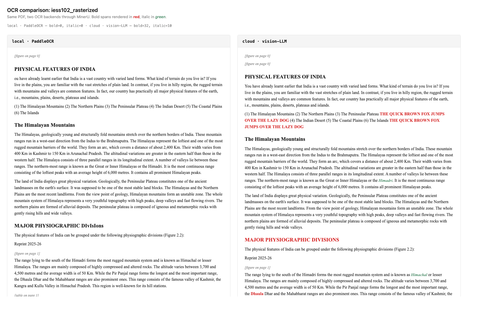

# MinerU True Copy

A Tauri desktop app that turns PDFs into editable documents while keeping the page intact. Built on top of [MinerU](https://github.com/opendatalab/MinerU). Adds vision-LLM OCR that survives bold and italics, layout-preserving export to DOCX, PPTX, and PDF, and an Indic translation sidecar tuned for Apple Silicon.

Bring your own OpenRouter key for cloud OCR. Local OCR via PaddleOCR is the default. No telemetry. No auth. No rate limit.



*Local PaddleOCR (left): 0 bold spans, 0 italic spans. Cloud vision-LLM (right): 32 bold spans (red), 10 italic spans (green). Reproduce with `node samples/run-ocr-comparison.mjs <your-pdf>` — see [samples/](samples/).*

## Why this exists

PaddleOCR strips typographic emphasis. Open a Hindi gazette in MinerU and the bold section headers come back as plain text. The structural information is real and visible on the page. The pipeline throws it away.

Vision-language models read it. Claude, Gemini, and the modern Qwen-VLs return bold and italic spans correctly when prompted for them. The right place to put a VLM is exactly where PaddleOCR sits: the OCR slot inside the MinerU pipeline. Everything downstream (block classification, reading order, equation handling) is too good to replace.

True-copy export sits next to the markdown export MinerU already produces. The markdown serializer drops page geometry. A different serializer measures glyphs against the original page bounds and writes DOCX, PPTX, or PDF that match the layout. The measurement engine is `@chenglou/pretext`, which needs a canvas. Tauri's WebKit renderer has one.

IndicTrans2 ships in the same Tauri bundle. MPS batching is tuned for 16GB Apple Silicon.

## Status

`v0.1.0` is in flight. The strip and scrub passes have landed on `main`. License, NOTICE, and proprietary code removal are done. The build runs locally on Apple Silicon today. A `.dmg` will land with the v0.1.0 tag.

The full development plan is below. It is honest about what is broken so contributors can show up.

## What is novel

Three pieces, all small relative to the value they unlock:

- `lib/vision_llm_ocr.py`. Replaces PaddleOCR with a vision LLM through OpenRouter. Returns text with `<b>` and `<i>` spans intact.
- `lib/translation.py`. IndicTrans2 server with MPS-aware batching and beam-width adapted to system RAM.
- `app/src/lib/export/`. The true-copy serializers. Pretext canvas measurement; per-glyph placement; preserves columns, indents, page rhythm.

`lib/patch_mineru.py` is the integration core. It monkey-patches MinerU at runtime. That patch is the reason this entire project inherits AGPL-3.0 from upstream.

## Architecture

```
Tauri shell ── Next.js UI ──┐
                            ├── HTTP ── mineru_server.py       (PaddleOCR + VLM, MinerU pipeline)
                            └── HTTP ── translation_server.py  (IndicTrans2, MPS)
```

The MinerU server is auto-spawned by Tauri as a sidecar; the translation server runs as a separate process the user starts manually (see [`docs/ARCHITECTURE.md`](docs/ARCHITECTURE.md)). The renderer is a Next.js app inside Tauri's WebKit. The renderer holds the export logic because Pretext needs a canvas.

## Quick start

A `.dmg` will land with the v0.1.0 tag. Until then, build from source on Apple Silicon:

```bash
git clone https://github.com/adoistic/mineru-true-copy.git
cd mineru-true-copy
```

See [`CONTRIBUTING.md`](CONTRIBUTING.md) for the full dev workflow. In short: a Python virtualenv with the MinerU dependencies, `npm install` inside `app/`, then `npx @tauri-apps/cli dev` from the project root.

To enable cloud OCR, open Settings, paste an OpenRouter key, save. The cloud option appears in the OCR mode selector.

## Built on the shoulders of

- [MinerU](https://github.com/opendatalab/MinerU) by OpenDataLab. Pipeline, layout analysis, block classification.
- [IndicTrans2](https://github.com/AI4Bharat/IndicTrans2) by AI4Bharat (IIT Madras). Indic translation models.
- [PaddleOCR](https://github.com/PaddlePaddle/PaddleOCR) by Baidu. Default OCR backend.
- [font-identifier](https://github.com/gaborcselle/font-identifier) by Gabor Cselle. ONNX font classifier.
- [Noto Sans](https://fonts.google.com/noto) and [Geist](https://vercel.com/font). UI and rendering fonts.

Full attribution and license terms in [NOTICE](NOTICE).

## Development plan

This section is the live plan. Tasks land roughly in order. v0.2 candidates are tracked as GitHub issues — see [Help wanted](#help-wanted) below.

### Phase 1: Strip, scrub, harden

The proprietary scaffolding (admin app, Firebase auth, activation key cache, credit ledger, white-label string filters) had to go before any of this could ship public. Then the server crash that filled `/tmp` with 6.7GB of debug logs needed a real fix. Then the BYO-key UX.

- [x] **T1.** Hard deletions. `admin/`, `app/src/lib/firebase/`, `app/src/lib/db/sqlite.ts` (later restored stripped), `app/src/app/api/{keys,credits}/`, the activation screen.
- [x] **T2.** Surgical strip across `runner.ts`, the pipeline modules, settings overlay, env config, and the white-label filters in `mineru_server.py`. Sanitize `.env.example`.
- [x] **T3.** Hardening of `mineru_server.py`. RotatingFileHandler at 50MB times 3. Demote per-page debug `print` calls to `logger.debug`. Sweep `/tmp/mineru_*` orphans on boot. Disk-space safeguard returns HTTP 507 if `/tmp` falls below 2GB. Pre-warm failure exits the process. Three pytest regressions cover the lot.
- [x] **T4.** ApiKeysPanel in Settings. OpenRouter key persists via `tauri-plugin-store`. Six explicit states (unset, typing, saving, set, editing, error). `sonner` toasts. Cloud OCR option in the mode selector binds reactively to "is key set".
- [x] **T5.** About screen in Settings. AGPL-3.0 notice, third-party attribution table, View Source link. Status bar gets a `v0.1.0 · AGPL-3.0` indicator that opens the About section in one click.
- [x] **T6.** Smoke test for `runner.ts` confirming the pipeline runs clean post-strip with a static guard against any return of credit or Firebase symbols.

### Phase 2: Refactor `mineru_server.py` (deferred to v0.2)

3,247 lines is too much to invite contributions to. The file splits into four modules: `server.py`, `cleanup.py`, `processing.py`, `fonts.py`. Filed as [issue #8](https://github.com/adoistic/mineru-true-copy/issues/8), `good first issue`. The split is mechanical work that benefits from a fresh pair of eyes.

### Phase 3: Public docs

- [x] [`LICENSE`](LICENSE). Full AGPL-3.0 from gnu.org.
- [x] [`NOTICE`](NOTICE). Third-party attribution and the AGPL forcing rationale.
- [x] [`README.md`](README.md). This file.
- [x] [`CONTRIBUTING.md`](CONTRIBUTING.md). Setup, dev workflow, PR submission, CI workflow notes.
- [x] [`docs/ARCHITECTURE.md`](docs/ARCHITECTURE.md). Tauri to Next.js to Python sidecars. Data flow for OCR, translation, export.
- [x] [`docs/ROADMAP.md`](docs/ROADMAP.md). Windows and Linux builds, broader VLM provider support, batch UI, future direction.
- [x] [`docs/HELP-WANTED.md`](docs/HELP-WANTED.md). The six concrete asks below, with file pointers.
- [x] Move the prior internal notes (`CLAUDE.md`, `DESIGN.md`, `TODOS.md`) to a gitignored `docs/internal/`. Write fresh public docs at the root.

### Phase 4: Ship infrastructure

- [x] [`.github/workflows/ci.yml`](.github/workflows/ci.yml) using [`tauri-apps/tauri-action`](https://github.com/tauri-apps/tauri-action). PR job runs `next lint`, `vitest`, `pytest`, and `cargo check`. Tag push (`v*`) builds the macOS `.dmg` and attaches the artifact to the GitHub Release.
- [x] CI strip-clean job. Fail any PR that reintroduces `firebase`, `deductCredit`, `activationKey`, or the prior brand strings.
- [x] [`.github/ISSUE_TEMPLATE/`](.github/ISSUE_TEMPLATE/) with bug report, feature request, and `good-first-issue` templates linked to HELP-WANTED items.
- [x] [`.github/PULL_REQUEST_TEMPLATE.md`](.github/PULL_REQUEST_TEMPLATE.md) with a NOTICE-update checkbox.

### Phase 5: Demo asset

- [ ] 30 to 60 second screen recording. Drop a Hindi government PDF, run cloud-mode OCR, translate to English, export DOCX, open with the layout intact.
- [ ] Two side-by-side comparison images for the README hero. PaddleOCR vs VLM on bold and italics. Markdown vs DOCX on layout preservation.

### Phase 6: Public flip

- [ ] File a polite issue at [opendatalab/MinerU](https://github.com/opendatalab/MinerU). Frame as ecosystem contribution, not fork. Title: "Built a desktop app on top of MinerU: MinerU True Copy". Same outreach to AI4Bharat.
- [ ] Tag `v0.1.0`. Push the `.dmg` to Releases.
- [ ] One tweet thread leading with the bold/italics comparison image. One HN post.

## Known limitations

These are real. Naming them is the price of asking for help.

1. **Windows and Linux builds.** None yet. Apple Silicon macOS only at v0.1 (the CI release job builds for the `macos-latest` runner's host arch — arm64). Intel and universal binaries are a v0.2 candidate.
2. **Discarded block recovery for styled headers.** MinerU's `Abandon` classifier sometimes misclassifies large styled headers as discarded. A content-bounds proposal exists but is not implemented.
3. **`mineru_server.py` is 3,247 lines.** Hard to read, harder to test. The module split is filed as [issue #8](https://github.com/adoistic/mineru-true-copy/issues/8).
4. **CI runs a thin slice of the test suite.** `pytest lib/tests/test_translation.py` is the only Python test in CI because the other 10 tests transitively import `mineru_server` and need the multi-GB MinerU dependency tree. The `requirements.txt` work that would let CI run the full suite is a `good-first-issue` (see [`docs/HELP-WANTED.md`](docs/HELP-WANTED.md)).
5. **Consumer-hardware perf on 16GB MacBook Air.** Translation works but the memory budget is tight. MPS pressure is the bottleneck.

## Help wanted

Each item is tracked on GitHub. Detail and file pointers in [`docs/HELP-WANTED.md`](docs/HELP-WANTED.md).

1. [#6](https://github.com/adoistic/mineru-true-copy/issues/6) — Windows and Linux builds via `tauri-action`.
2. [#7](https://github.com/adoistic/mineru-true-copy/issues/7) — Discarded block recovery: replace the Abandon-class heuristic with content-bounds.
3. [#8](https://github.com/adoistic/mineru-true-copy/issues/8) — `mineru_server.py` module split (`good first issue`).
4. [#9](https://github.com/adoistic/mineru-true-copy/issues/9) — Document the Python dependency manifest (`requirements.txt`) (`good first issue`).
5. [#10](https://github.com/adoistic/mineru-true-copy/issues/10) — Memory budget on 16 GB Apple Silicon (translation MPS tuning).
6. [#11](https://github.com/adoistic/mineru-true-copy/issues/11) — Fix pre-existing lint errors so CI lint can be a hard gate (`good first issue`).

## License

AGPL-3.0. Forced by upstream MinerU. `lib/patch_mineru.py` patches MinerU's internals at runtime, which makes this project a derivative work. The patch targets MinerU 2.x (the `magic_pdf` package); MinerU 3.0+ moved to the `mineru` namespace under a different license and is not supported here. Full license text in [LICENSE](LICENSE). Third-party attribution in [NOTICE](NOTICE).

If you run a modified version of this software as a network service, AGPL §13 obliges you to publish your modifications.

## Acknowledgements

OpenDataLab for MinerU. AI4Bharat for IndicTrans2. The PaddleOCR team. Gabor Cselle for `font-identifier`.

## Contact

Adnan Abbasi. Issues and PRs welcome on this repo.
